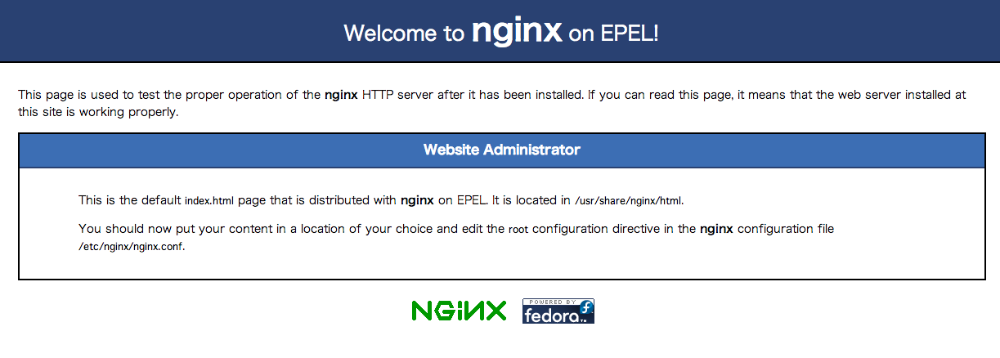

# chef-solo + Vagrant on Mac OS X

Mac OS XをホストOSとしてchef-solo。

## Getting Started

### chef-soloインストール

```
curl -L http://www.opscode.com/chef/install.sh | sudo bash
Password:  % Total    % Received % Xferd  Average Speed   Time    Time     Time  Current
                                 Dload  Upload   Total   Spent    Left  Speed
100  6789  100  6789    0     0  12087      0 --:--:-- --:--:-- --:--:-- 20085

Downloading Chef  for mac_os_x...
.......................................................................................................................................................................................................................................................................................................
Thank you for installing Chef!
```

最初躓いたんだけど、「おいおい、chefインストールできないじゃん」って思ってたらこれ、最初にsudoかましてるところでcurlの出力にPasswordのプロンプト出てたし。。。パスワード入力してsudo通すようにしたらインストール出来ました。

### Knifeのお手入れ

切れ味を良くしましょう。  
初回のみでOK。

```
knife configure
```

### レポジトリの作成

```
git clone git://github.com/opscode/chef-repo.git
```

して、

```
cd chef-repo/
knife cookbook create hello -o cookbooks

** Creating cookbook hello
** Creating README for cookbook: hello
** Creating CHANGELOG for cookbook: hello
** Creating metadata for cookbook: hello
```

### レシピ編集

```ruby
# cookbooks/hello/recipes/default.rb
#
# Cookbook Name:: hello
# Recipe:: default
#
# Copyright 2013, YOUR_COMPANY_NAME
#
# All rights reserved - Do Not Redistribute
#

log "Hello, Chef!"
```

### 実行するレシピの一覧の定義

```json
// localhost.json
{
  "run_list": [
    "recipe[hello]"
  ]
}

```

### chef-soloの設定

```ruby
# solo.rb
file_cache_path "/tmp/chef-solo"
cookbook_path [ "/home/wnoguchi/chef-repo/cookbooks" ]
```

### 実行

```
sudo chef-solo -c solo.rb -j ./localhost.json

Starting Chef Client, version 11.6.0
Unable to find any JVMs matching version "(null)".
No Java runtime present, try --request to install.
Compiling Cookbooks...
Converging 1 resources
Recipe: hello::default
  * log[Hello, Chef!] action write

Chef Client finished, 1 resources updated
```

Hello, Chef!は無事表示されたけど、

```
Unable to find any JVMs matching version "(null)".
No Java runtime present, try --request to install.
```

なんじゃこのメッセージは。。。

- [OSX Mountain Lion and Java | The Syncing Apple](http://dillernet.com/apple/2012/07/27/osx-mountain-lion-and-java/)

jdkがないのが原因らしい。

```
javac
```

って打ったらなんかダイアログ出てきて、自動的にインストールできた。  
chefは内部的にjdk使ってるのか？  
今度はエラーメッセージ表示されなくなったのでモーマンタイ。

```
Starting Chef Client, version 11.6.0
Compiling Cookbooks...
Converging 1 resources
Recipe: hello::default
  * log[Hello, Chef!] action write

Chef Client finished, 1 resources updated
```

chef-soloで僕のmac環境を壊すのは嫌なので、Vagrantで立ち上げたVMにchef-soloを入れようと思う。  
そうしよう。

## Vagrant導入

http://www.vagrantbox.es/

気軽に仮想マシンを立ち上げて希望の環境を作るための最高の環境。  
構成ファイル `Vagrantfile` とかで仮想マシンのスペックを記述して、  
コマンドで数発叩いてイニシャルな状態の仮想マシンが立ち上げ、停止、削除が気軽にできる。  
さらにはchef-soloとの合わせ技で起動した仮想マシンの構成管理までできてしまう。  
エンジニアのスキルによらず冪等性があり、再現性の高い仮想マシンを構築することができる。  
動いた動かないの話が少なくなる。

Vagrantのインストールの仕方は忘れた。  
何か特別なこと考えなくてもインストールできます。  
基本的にVirtualBox必須。  
というかそれ以外のやり方知らない。

* boxファイル追加

```
# CentOS 6.3
vagrant box add base http://developer.nrel.gov/downloads/vagrant-boxes/CentOS-6.3-x86_64-v20130101.box
（...とても時間がかかる）

# CentOS 6.4
vagrant box add base http://developer.nrel.gov/downloads/vagrant-boxes/CentOS-6.4-x86_64-v20130731.box
```

* Vagrantファイルその他作成

```
mkdir vagrant1
cd vagrant1
vagrant init

A `Vagrantfile` has been placed in this directory. You are now
ready to `vagrant up` your first virtual environment! Please read
the comments in the Vagrantfile as well as documentation on
`vagrantup.com` for more information on using Vagrant.
```

* ホストオンリーネットワークの記述

```ruby
# Vagrantfile
Vagrant::Config.run do |config|
  config.vm.box = "base"
#(snip)
  config.vm.network :private_network, ip: "192.168.50.12"
#(snip)
```

* 仮想マシン起動

```
vagrant up

Bringing machine 'default' up with 'virtualbox' provider...
[default] Importing base box 'base'...
[default] Matching MAC address for NAT networking...
[default] Setting the name of the VM...
[default] Clearing any previously set forwarded ports...
[default] Fixed port collision for 22 => 2222. Now on port 2200.
[default] Creating shared folders metadata...
[default] Clearing any previously set network interfaces...
[default] Preparing network interfaces based on configuration...
[default] Forwarding ports...
[default] -- 22 => 2200 (adapter 1)
[default] Booting VM...
[default] Waiting for machine to boot. This may take a few minutes...
[default] Machine booted and ready!
[default] Configuring and enabling network interfaces...
[default] Mounting shared folders...
[default] -- /vagrant
```

* SSH

```
vagrant ssh

Welcome to your Vagrant-built virtual machine.
[vagrant@localhost ~]$ cat /etc/redhat-release 
CentOS release 6.4 (Final)
[vagrant@localhost ~]$ exit
logout
Connection to 127.0.0.1 closed.
```

あるいはSSHターミナルで普通にIPアドレス叩いてつながります。

- ID: `root`
- PASS: `vagrant`

あるいはvagrantユーザー上でパス無し `sudo -i` ができます。

* SSHアクセス設定をする

秘密鍵を設定する。  
`~/.ssh/config` を設定するんだけど、めんどくさいのでコマンドで流し込む。  
teeコマンドでどんな内容が追記されたのか一応確認。  
`-a` オプション付けないとconfigファイルが上書きされて無く事になるので注意。

`--host` オプションにはアクセスしたいこのVagrant VMの好きなホスト名を指定します。  
以下は `yunocchi` でアクセスできる。  
以下の設定ファイルを見るととても興味深くて、UserKnownHostsFileに`/dev/null`を指定していて  
Warningが出るのを防いでいるところ。  
実験用のVMだからフィンガープリントは変化しまくるのを見越してのことでしょう。

```
vagrant ssh-config --host yunocchi | tee -a ~/.ssh/config

Host yunocchi
  HostName 127.0.0.1
  User vagrant
  Port 2200
  UserKnownHostsFile /dev/null
  StrictHostKeyChecking no
  PasswordAuthentication no
  IdentityFile /Users/noguchiwataru/.vagrant.d/insecure_private_key
  IdentitiesOnly yes
  LogLevel FATAL
```

* つないでみる

```
localhost:vagrant1 noguchiwataru$ ssh yunocchi
Last login: Wed Oct  9 14:28:13 2013 from 10.0.2.2
Welcome to your Vagrant-built virtual machine.
[vagrant@localhost ~]$ 
```

* 停止

```
vagrant halt

[default] Attempting graceful shutdown of VM...
```

* 破壊

```
vagrant destroy

Are you sure you want to destroy the 'default' VM? [y/N] y
[default] Destroying VM and associated drives...
```

### sahara でスナップショット、ロールバック

* インストール

```
>vagrant plugin install sahara

Installing the 'sahara' plugin. This can take a few minutes...
Installed the plugin 'sahara (0.0.15)'!
```

* sandboxモードを有効にする

この時点が起点となる。

```
vagrant up

vagrant sandbox on

0%...10%...20%...30%...40%...50%...60%...70%...80%...90%...100%
```

* 何か作業する

ためしにApacheでもいれてみよう。

```
service iptables stop
yum -y install httpd
service httpd start
```

* ロールバックする

よし、気に入らないから戻そう！

```
>vagrant sandbox rollback

0%...10%...20%...30%...40%...50%...60%...70%...80%...90%...100%
0%...10%...20%...30%...40%...50%...60%...70%...80%...90%...100%
```

おーすごーい。

* コミット

気に入った設定になったらコミットします。状態を確定する操作です。  
これ、なんか重いんだよね。。。どうにかなんないのかしら。

```
>vagrant sandbox commit

>vagrant sandbox off
```

## knife-solo + Vagrantの連携

### knife-soloのインストール

0.3.0系推奨。

```
gem install knife-solo --no-ri --no-rdoc

gem list | grep knife-solo

knife-solo (0.3.0)
```

### VMにchef-solo環境を構築

```
knife solo prepare yunocchi

Bootstrapping Chef...
  % Total    % Received % Xferd  Average Speed   Time    Time     Time  Current
                                 Dload  Upload   Total   Spent    Left  Speed
101  6790  101  6790    0     0   1110      0  0:00:06  0:00:06 --:--:-- 18501
Downloading Chef 11.6.0 for el...
Installing Chef 11.6.0
警告: /tmp/tmp.7nhqIjwd/chef-11.6.0.x86_64.rpm: ヘッダ V4 DSA/SHA1 Signature, key ID 83ef826a: NOKEY
準備中...                ########################################### [100%]
	パッケージ chef-11.6.0-1.el6.x86_64 は既にインストールされています。
Generating node config 'nodes/yunocchi.json'...
```

既にインストールされてるみたい。

### 新規Chefレポジトリを作成

```
knife solo init chef-repo

Creating kitchen...
Creating knife.rb in kitchen...
Creating cupboards...

.
├── Vagrantfile
├── chef-repo
│   ├── cookbooks
│   ├── data_bags
│   ├── nodes
│   ├── roles
│   └── site-cookbooks
└── nodes
    └── yunocchi.json

7 directories, 2 files
```

* ポイントは 0.3.0 以降からは `solo.rb` がいらないということ。
* 生成した Chefレポジトリ chef-solo はgitで管理する。

### cookbookを作る

```
knife cookbook create hello -o site-cookbooks

** Creating cookbook hello
** Creating README for cookbook: hello
** Creating CHANGELOG for cookbook: hello
** Creating metadata for cookbook: hello
```

* VMにcookbookを転送してchef-soloを実行する

```
knife solo cook yunocchi

Running Chef on yunocchi...
Checking Chef version...
ERROR: Network Error: Connection refused - connect(2)
Check your knife configuration and network settings
```

なにこれ。

- [Saheb's Blog: Check your knife configuration and network settings, unable to upload cookbooks](http://sahebjade.blogspot.jp/2013/05/check-your-knife-configuration-and.html)
- [Webサービスって作れるのか - わくぶろぐ](http://kazu-waku.hatenablog.com/entry/2013/07/28/004324)

```
ssh yunocchi
```

なんかしばらく触ってなかったからsshできないっぽい。  
しかもなんかポート番号変わってるでよ。  
configのyunocchiエントリー削除して再生成した。

```
vagrant ssh-config --host yunocchi | tee -a ~/.ssh/config

Host yunocchi
  HostName 127.0.0.1
  User vagrant
  Port 2222
  UserKnownHostsFile /dev/null
  StrictHostKeyChecking no
  PasswordAuthentication no
  IdentityFile /Users/noguchiwataru/.vagrant.d/insecure_private_key
  IdentitiesOnly yes
  LogLevel FATAL

```

もいっかい。

```
cd chef-repo/

knife solo cook yunocchi
Running Chef on yunocchi...
Checking Chef version...
Uploading the kitchen...
Generating solo config...
Running Chef...
/opt/chef/embedded/lib/ruby/gems/1.9.1/gems/yajl-ruby-1.1.0/lib/yajl.rb:36:in `parse': lexical error: invalid char in json text. (Yajl::ParseError)
                          {"run_list":[chef-repo::hello]} 
                     (right here) ------^
	from /opt/chef/embedded/lib/ruby/gems/1.9.1/gems/yajl-ruby-1.1.0/lib/yajl.rb:36:in `parse'
	from /opt/chef/embedded/lib/ruby/gems/1.9.1/gems/chef-11.6.0/lib/chef/json_compat.rb:56:in `from_json'
	from /opt/chef/embedded/lib/ruby/gems/1.9.1/gems/chef-11.6.0/lib/chef/application/solo.rb:198:in `reconfigure'
	from /opt/chef/embedded/lib/ruby/gems/1.9.1/gems/chef-11.6.0/lib/chef/application.rb:64:in `run'
	from /opt/chef/embedded/lib/ruby/gems/1.9.1/gems/chef-11.6.0/bin/chef-solo:25:in `<top (required)>'
	from /usr/bin/chef-solo:23:in `load'
	from /usr/bin/chef-solo:23:in `<main>'
ERROR: RuntimeError: chef-solo failed. See output above.

```

- [chef-soloとknife-soloで手軽に環境構築をする - Bouldering & Com.](http://shrkw.hatenablog.com/entry/configure_with_chef-solo_and_knife-solo)

今いるディレクトリがまちがってるんじゃないか？

```
cd ..

knife solo cook yunocchi

Running Chef on yunocchi...
Checking Chef version...
Uploading the kitchen...
WARNING: Local cookbook_path '/var/chef/cookbooks' does not exist
WARNING: Local cookbook_path '/var/chef/site-cookbooks' does not exist
WARNING: Local role_path '/var/chef/roles' does not exist
WARNING: Local data_bag_path '/var/chef/data_bags' does not exist
Generating solo config...
Running Chef...
Starting Chef Client, version 11.6.0
Compiling Cookbooks...
Converging 0 resources
Chef Client finished, 0 resources updated
```

[Chef Soloの正しい始め方 | tsuchikazu blog](http://tsuchikazu.net/chef_solo_start/)

```
#
# Cookbook Name:: hello
# Recipe:: default
#
# Copyright 2013, YOUR_COMPANY_NAME
#
# All rights reserved - Do Not Redistribute
#

log "hello, chef-solo."

package "httpd" do
  action :install
end

service "httpd" do
  supports :status => true, :restart => true, :reload => true
  action [ :enable, :start ]
end

service "iptables" do
  supports :status => true, :restart => true, :reload => true
  action [ :enable, :stop ]
end

```

```
[vagrant@localhost ~]$ sudo cat /var/chef/cache/chef-stacktrace.out
Generated at 2013-10-14 00:47:01 +0000
Chef::Exceptions::CookbookNotFound: Cookbook chef-repo not found. If you're loading chef-repo from another cookbook, make sure you configure the dependency in your metadata
/opt/chef/embedded/lib/ruby/gems/1.9.1/gems/chef-11.6.0/lib/chef/cookbook/cookbook_collection.rb:38:in `block in initialize'
/opt/chef/embedded/lib/ruby/gems/1.9.1/gems/ohai-6.18.0/lib/ohai/mash.rb:77:in `yield'
/opt/chef/embedded/lib/ruby/gems/1.9.1/gems/ohai-6.18.0/lib/ohai/mash.rb:77:in `default'
/opt/chef/embedded/lib/ruby/gems/1.9.1/gems/ohai-6.18.0/lib/ohai/mash.rb:77:in `default'
/opt/chef/embedded/lib/ruby/gems/1.9.1/gems/chef-11.6.0/lib/chef/run_context/cookbook_compiler.rb:265:in `[]'
/opt/chef/embedded/lib/ruby/gems/1.9.1/gems/chef-11.6.0/lib/chef/run_context/cookbook_compiler.rb:265:in `each_cookbook_dep'
/opt/chef/embedded/lib/ruby/gems/1.9.1/gems/chef-11.6.0/lib/chef/run_context/cookbook_compiler.rb:243:in `add_cookbook_with_deps'
/opt/chef/embedded/lib/ruby/gems/1.9.1/gems/chef-11.6.0/lib/chef/run_context/cookbook_compiler.rb:87:in `block in cookbook_order'
/opt/chef/embedded/lib/ruby/gems/1.9.1/gems/chef-11.6.0/lib/chef/run_context/cookbook_compiler.rb:85:in `each'
/opt/chef/embedded/lib/ruby/gems/1.9.1/gems/chef-11.6.0/lib/chef/run_context/cookbook_compiler.rb:85:in `cookbook_order'
/opt/chef/embedded/lib/ruby/gems/1.9.1/gems/chef-11.6.0/lib/chef/run_context/cookbook_compiler.rb:97:in `compile_libraries'
/opt/chef/embedded/lib/ruby/gems/1.9.1/gems/chef-11.6.0/lib/chef/run_context/cookbook_compiler.rb:70:in `compile'
/opt/chef/embedded/lib/ruby/gems/1.9.1/gems/chef-11.6.0/lib/chef/run_context.rb:86:in `load'
/opt/chef/embedded/lib/ruby/gems/1.9.1/gems/chef-11.6.0/lib/chef/client.rb:249:in `setup_run_context'
/opt/chef/embedded/lib/ruby/gems/1.9.1/gems/chef-11.6.0/lib/chef/client.rb:492:in `do_run'
/opt/chef/embedded/lib/ruby/gems/1.9.1/gems/chef-11.6.0/lib/chef/client.rb:199:in `block in run'
/opt/chef/embedded/lib/ruby/gems/1.9.1/gems/chef-11.6.0/lib/chef/client.rb:193:in `fork'
/opt/chef/embedded/lib/ruby/gems/1.9.1/gems/chef-11.6.0/lib/chef/client.rb:193:in `run'
/opt/chef/embedded/lib/ruby/gems/1.9.1/gems/chef-11.6.0/lib/chef/application.rb:183:in `run_chef_client'
/opt/chef/embedded/lib/ruby/gems/1.9.1/gems/chef-11.6.0/lib/chef/application/solo.rb:239:in `block in run_application'
/opt/chef/embedded/lib/ruby/gems/1.9.1/gems/chef-11.6.0/lib/chef/application/solo.rb:231:in `loop'
/opt/chef/embedded/lib/ruby/gems/1.9.1/gems/chef-11.6.0/lib/chef/application/solo.rb:231:in `run_application'
/opt/chef/embedded/lib/ruby/gems/1.9.1/gems/chef-11.6.0/lib/chef/application.rb:66:in `run'
/opt/chef/embedded/lib/ruby/gems/1.9.1/gems/chef-11.6.0/bin/chef-solo:25:in `<top (required)>'
/usr/bin/chef-solo:23:in `load'
/usr/bin/chef-solo:23:in `<main>'[vagrant@localhost ~]$ 
```

* [chef (11.6.0) + knife-solo (0.3.0.pre5)は相性が悪いっぽい? - じゅにゃくんのはてブロ。](http://jun-ya.hatenablog.com/entry/2013/07/25/111756)

11.4にダウングレードしてみる。

```
source "https://rubygems.org"

gem 'knife-solo', '0.3.0'
gem 'chef', '11.4.4'
```

```
bundle install --path vendor/bundle

(snip)

Post-install message from knife-solo:
Thanks for installing knife-solo!

If you run into any issues please let us know at:
  https://github.com/matschaffer/knife-solo/issues

If you are upgrading knife-solo please uninstall any old versions by
running `gem clean knife-solo` to avoid any errors.

See http://bit.ly/CHEF-3255 for more information on the knife bug
that causes this.
```

```
knife configure

WARNING: No knife configuration file found
Where should I put the config file? [/Users/noguchiwataru/.chef/knife.rb] 
Please enter the chef server URL: [https://localhost:443] 
Please enter an existing username or clientname for the API: [noguchiwataru] 
Please enter the validation clientname: [chef-validator] 
Please enter the location of the validation key: [/etc/chef-server/chef-validator.pem] 
Please enter the path to a chef repository (or leave blank): 
*****

You must place your client key in:
  /Users/noguchiwataru/.chef/noguchiwataru.pem
Before running commands with Knife!

*****

You must place your validation key in:
  /etc/chef-server/chef-validator.pem
Before generating instance data with Knife!

*****
Configuration file written to /Users/noguchiwataru/.chef/knife.rb

```

```
cat <<EOF >>~/.chef/knife.rb
knife[:solo_path] = '/tmp/chef-solo'
EOF
```

```
bundle exec knife solo init chef-repo

Creating kitchen...
Creating knife.rb in kitchen...
Creating cupboards...

```

以降、`chef-repo`を起点ディレクトリとする。

```
cd chef-repo/
bundle exec knife cookbook create hello -o site-cookbooks

** Creating cookbook hello
** Creating README for cookbook: hello
** Creating CHANGELOG for cookbook: hello
** Creating metadata for cookbook: hello
```

```
# nodes/yunocchi.json
{"run_list":["hello::default"]}
```

```
bundle exec knife solo cook yunocchi

Running Chef on yunocchi...
Checking Chef version...
Uploading the kitchen...
Generating solo config...
Running Chef...
Starting Chef Client, version 11.6.0
Compiling Cookbooks...
Converging 4 resources
Recipe: hello::default
  * log[hello, chef-solo.] action write

  * package[httpd] action install
    - install version 2.2.15-29.el6.centos of package httpd

  * service[httpd] action enable
    - enable service service[httpd]

  * service[httpd] action start
    - start service service[httpd]

  * service[iptables] action enable (up to date)
  * service[iptables] action stop
    - stop service service[iptables]

Chef Client finished, 5 resources updated
```

ふむ。

```
# nodes/yunocchi.json
{"run_list":["hello"]}
```

に変えてみた。動く。

`{"run_list":["hello"]}` とダブルクォートでくくらないで書くとエラーになる。  
書き方の問題か・・・。  
とりあえず動いた。よかった。

* [入門 Chef Solo 第17章 レシピ落ち穂拾い - run_list, ファイル分け, include_recipe - 毎朝30分読書会](http://d.hatena.ne.jp/morning_reading/20130806/p1)

### nginxの立ち上げ

* クックブック作成

```
bundle exec knife cookbook create nginx -o site-cookbooks
```

* `nodes/yunocchi.json` の編集

nginxクックブックを実行するように指定。

```
{"run_list":["nginx"]}
```

* レシピの編集

```
package "nginx" do
  action :install
end

service "nginx" do
  supports :status => true, :restart => true, :reload => true
  action [ :enable, :start ]
end

service "iptables" do
  supports :status => true, :restart => true, :reload => true
  action [ :enable, :stop ]
end
```

* chef-solo実行

knife solo経由で。

```
bundle exec knife solo cook yunocchi
Running Chef on yunocchi...
Checking Chef version...
Uploading the kitchen...
Generating solo config...
Running Chef...
Starting Chef Client, version 11.6.0
Compiling Cookbooks...
Converging 3 resources
Recipe: nginx::default
  * package[nginx] action install
    * No version specified, and no candidate version available for nginx
================================================================================
Error executing action `install` on resource 'package[nginx]'
================================================================================


Chef::Exceptions::Package
-------------------------
No version specified, and no candidate version available for nginx


Resource Declaration:
---------------------
# In /home/vagrant/chef-solo/cookbooks-2/nginx/recipes/default.rb

 10: package "nginx" do
 11:   action :install
 12: end
 13: 


Compiled Resource:
------------------
# Declared in /home/vagrant/chef-solo/cookbooks-2/nginx/recipes/default.rb:10:in `from_file'

package("nginx") do
  action [:install]
  retries 0
  retry_delay 2
  package_name "nginx"
  cookbook_name :nginx
  recipe_name "default"
end


[2013-10-14T13:45:08+00:00] ERROR: Running exception handlers
[2013-10-14T13:45:08+00:00] ERROR: Exception handlers complete
[2013-10-14T13:45:08+00:00] FATAL: Stacktrace dumped to /var/chef/cache/chef-stacktrace.out
Chef Client failed. 0 resources updated
[2013-10-14T13:45:08+00:00] FATAL: Chef::Exceptions::ChildConvergeError: Chef run process exited unsuccessfully (exit code 1)
ERROR: RuntimeError: chef-solo failed. See output above.
```

Amazon Linuxじゃないときつめか。

## Opscode Communityのクックボックをインポートする

膨大なクックブックの集積を利用する。

サインアップして秘密鍵を取得。パーミッションは600に設定。

```
cat <<EOF >>~/.chef/knife.rb
client_key '~/Dropbox/chef/wnoguchi.pem'
cookbook_path ['./cookbooks']
EOF
```

* yumクックブックを使ってみる

リポジトリはバージョン管理下にあり、ワークツリーはクリーンな状態であるとする。

```
bundle exec knife solo init chef-repo
cd chef-repo/
git init && git add -A && git commit -m "Initial commit."
```

```
bundle exec knife cookbook site vendor yum

Removing pre-existing version.
Uncompressing yum version 2.3.4.
removing downloaded tarball
No changes made to yum
Checking out the master branch.
```

yumのクックブックは入ったみたいだけど、自動的にコミットは行われていないように見えるなり。  
`.gitignore` を見ると `/cookbook/` 以下がまるごと無視されるいるようです。

```
.
├── cookbooks
│   └── yum
│       ├── CHANGELOG.md
│       ├── README.md
│       ├── attributes
│       │   ├── default.rb
│       │   ├── elrepo.rb
│       │   ├── epel.rb
│       │   └── remi.rb
│       ├── files
│       │   └── default
│       │       └── tests
│       │           └── minitest
│       │               ├── default_test.rb
│       │               ├── support
│       │               │   └── helpers.rb
│       │               └── test_test.rb
│       ├── metadata.json
│       ├── metadata.rb
│       ├── providers
│       │   ├── key.rb
│       │   └── repository.rb
│       ├── recipes
│       │   ├── default.rb
│       │   ├── elrepo.rb
│       │   ├── epel.rb
│       │   ├── ius.rb
│       │   ├── remi.rb
│       │   ├── repoforge.rb
│       │   ├── test.rb
│       │   └── yum.rb
│       ├── resources
│       │   ├── key.rb
│       │   └── repository.rb
│       └── templates
│           └── default
│               ├── repo.erb
│               ├── yum-rhel5.conf.erb
│               └── yum-rhel6.conf.erb
├── data_bags
├── nodes
├── roles
└── site-cookbooks

17 directories, 26 files

```

* epelを有効にする

```
{"run_list":["yum::epel"]}
```

* 料理する

```
Running Chef on yunocchi...
Checking Chef version...
Uploading the kitchen...
Generating solo config...
Running Chef...
Starting Chef Client, version 11.6.2
Compiling Cookbooks...
Converging 2 resources
Recipe: yum::epel
  * yum_key[RPM-GPG-KEY-EPEL-6] action add (up to date)
Recipe: <Dynamically Defined Resource>
  * package[gnupg2] action install (up to date)
  * execute[import-rpm-gpg-key-RPM-GPG-KEY-EPEL-6] action nothing (skipped due to action :nothing)
  * remote_file[/etc/pki/rpm-gpg/RPM-GPG-KEY-EPEL-6] action create
    - create new file /etc/pki/rpm-gpg/RPM-GPG-KEY-EPEL-6
    - update content in file /etc/pki/rpm-gpg/RPM-GPG-KEY-EPEL-6 from none to 626e18
        --- /etc/pki/rpm-gpg/RPM-GPG-KEY-EPEL-6	2013-10-15 15:27:44.459652833 +0000
        +++ /tmp/chef-rest20131015-3515-1qe13r7	2013-10-15 15:27:50.111818943 +0000
        @@ -0,0 +1,29 @@
        +-----BEGIN PGP PUBLIC KEY BLOCK-----
        +Version: GnuPG v1.4.5 (GNU/Linux)
        +
        +mQINBEvSKUIBEADLGnUj24ZVKW7liFN/JA5CgtzlNnKs7sBg7fVbNWryiE3URbn1
        +JXvrdwHtkKyY96/ifZ1Ld3lE2gOF61bGZ2CWwJNee76Sp9Z+isP8RQXbG5jwj/4B
        +M9HK7phktqFVJ8VbY2jfTjcfxRvGM8YBwXF8hx0CDZURAjvf1xRSQJ7iAo58qcHn
        +XtxOAvQmAbR9z6Q/h/D+Y/PhoIJp1OV4VNHCbCs9M7HUVBpgC53PDcTUQuwcgeY6
        +pQgo9eT1eLNSZVrJ5Bctivl1UcD6P6CIGkkeT2gNhqindRPngUXGXW7Qzoefe+fV
        +QqJSm7Tq2q9oqVZ46J964waCRItRySpuW5dxZO34WM6wsw2BP2MlACbH4l3luqtp
        +Xo3Bvfnk+HAFH3HcMuwdaulxv7zYKXCfNoSfgrpEfo2Ex4Im/I3WdtwME/Gbnwdq
        +3VJzgAxLVFhczDHwNkjmIdPAlNJ9/ixRjip4dgZtW8VcBCrNoL+LhDrIfjvnLdRu
        +vBHy9P3sCF7FZycaHlMWP6RiLtHnEMGcbZ8QpQHi2dReU1wyr9QgguGU+jqSXYar
        +1yEcsdRGasppNIZ8+Qawbm/a4doT10TEtPArhSoHlwbvqTDYjtfV92lC/2iwgO6g
        +YgG9XrO4V8dV39Ffm7oLFfvTbg5mv4Q/E6AWo/gkjmtxkculbyAvjFtYAQARAQAB
        +tCFFUEVMICg2KSA8ZXBlbEBmZWRvcmFwcm9qZWN0Lm9yZz6JAjYEEwECACAFAkvS
        +KUICGw8GCwkIBwMCBBUCCAMEFgIDAQIeAQIXgAAKCRA7Sd8qBgi4lR/GD/wLGPv9
        +qO39eyb9NlrwfKdUEo1tHxKdrhNz+XYrO4yVDTBZRPSuvL2yaoeSIhQOKhNPfEgT
        +9mdsbsgcfmoHxmGVcn+lbheWsSvcgrXuz0gLt8TGGKGGROAoLXpuUsb1HNtKEOwP
        +Q4z1uQ2nOz5hLRyDOV0I2LwYV8BjGIjBKUMFEUxFTsL7XOZkrAg/WbTH2PW3hrfS
        +WtcRA7EYonI3B80d39ffws7SmyKbS5PmZjqOPuTvV2F0tMhKIhncBwoojWZPExft
        +HpKhzKVh8fdDO/3P1y1Fk3Cin8UbCO9MWMFNR27fVzCANlEPljsHA+3Ez4F7uboF
        +p0OOEov4Yyi4BEbgqZnthTG4ub9nyiupIZ3ckPHr3nVcDUGcL6lQD/nkmNVIeLYP
        +x1uHPOSlWfuojAYgzRH6LL7Idg4FHHBA0to7FW8dQXFIOyNiJFAOT2j8P5+tVdq8
        +wB0PDSH8yRpn4HdJ9RYquau4OkjluxOWf0uRaS//SUcCZh+1/KBEOmcvBHYRZA5J
        +l/nakCgxGb2paQOzqqpOcHKvlyLuzO5uybMXaipLExTGJXBlXrbbASfXa/yGYSAG
        +iVrGz9CE6676dMlm8F+s3XXE13QZrXmjloc6jwOljnfAkjTGXjiB7OULESed96MR
        +XtfLk0W5Ab9pd7tKDR6QHI7rgHXfCopRnZ2VVQ==
        +=V/6I
        +-----END PGP PUBLIC KEY BLOCK-----
    - change mode from '' to '0644'

  * execute[import-rpm-gpg-key-RPM-GPG-KEY-EPEL-6] action run
    - execute rpm --import /etc/pki/rpm-gpg/RPM-GPG-KEY-EPEL-6

Recipe: yum::epel
  * yum_repository[epel] action add (up to date)
Recipe: <Dynamically Defined Resource>
  * yum_key[epel-key] action add (up to date)
  * execute[yum-makecache-epel] action nothing (skipped due to action :nothing)
  * ruby_block[reload-internal-yum-cache-for-epel] action nothing (skipped due to action :nothing)
  * template[/etc/yum.repos.d/epel.repo] action create
    - create new file /etc/yum.repos.d/epel.repo
    - update content in file /etc/yum.repos.d/epel.repo from none to 18fb55
        --- /etc/yum.repos.d/epel.repo	2013-10-15 15:27:50.316722833 +0000
        +++ /tmp/chef-rendered-template20131015-3515-1nutqve	2013-10-15 15:27:50.318721833 +0000
        @@ -0,0 +1,8 @@
        +# Generated by Chef for localhost
        +# Local modifications will be overwritten.
        +[epel]
        +name=Extra Packages for Enterprise Linux
        +mirrorlist=http://mirrors.fedoraproject.org/mirrorlist?repo=epel-6&arch=$basearch
        +gpgcheck=1
        +gpgkey=file:///etc/pki/rpm-gpg/RPM-GPG-KEY-EPEL-6
        +enabled=1
    - change mode from '' to '0644'

  * execute[yum-makecache-epel] action run
    - execute yum -q makecache --disablerepo=* --enablerepo=epel

  * ruby_block[reload-internal-yum-cache-for-epel] action create
    - execute the ruby block reload-internal-yum-cache-for-epel

Chef Client finished, 5 resources updated
```

epelが入ったかどうか確認する。

```
noguchiwataru-no-MacBook-Air:vagrant1 noguchiwataru$ vagrant ssh
Last login: Tue Oct 15 15:27:42 2013 from 10.0.2.2
Welcome to your Vagrant-built virtual machine.
[vagrant@localhost ~]$ sudo yum repolist
Loaded plugins: fastestmirror
Loading mirror speeds from cached hostfile
 * base: mirror.fairway.ne.jp
 * epel: ftp.kddilabs.jp
 * extras: mirror.fairway.ne.jp
 * updates: mirror.fairway.ne.jp
repo id                           repo name                                                      status
base                              CentOS-6 - Base                                                6,381
epel                              Extra Packages for Enterprise Linux                            9,789
extras                            CentOS-6 - Extras                                                 13
updates                           CentOS-6 - Updates                                             1,367
repolist: 17,550

```

入ってるね。

じゃあさっき失敗したnginxのクックブックももう一回トライしてみるか。

```
bundle exec knife cookbook create nginx -o site-cookbooks
cat <<EOF >>site-cookbooks/nginx/recipes/default.rb
package "nginx" do
  action :install
end

service "nginx" do
  supports :status => true, :restart => true, :reload => true
  action [ :enable, :start ]
end

service "iptables" do
  supports :status => true, :restart => true, :reload => true
  action [ :enable, :stop ]
end
EOF
```

```
// nodes/yunocchi.json
{"run_list":["yum::epel", "nginx"]}
```

```
bundle exec knife solo cook yunocchi

Running Chef on yunocchi...
Checking Chef version...
Uploading the kitchen...
Generating solo config...
Running Chef...
Starting Chef Client, version 11.6.2
Compiling Cookbooks...
Converging 5 resources
Recipe: yum::epel
  * yum_key[RPM-GPG-KEY-EPEL-6] action add (up to date)
  * yum_repository[epel] action add (up to date)
Recipe: nginx::default
  * package[nginx] action install
    - install version 1.0.15-5.el6 of package nginx

  * service[nginx] action enable
    - enable service service[nginx]

  * service[nginx] action start
================================================================================
Error executing action `start` on resource 'service[nginx]'
================================================================================


Mixlib::ShellOut::ShellCommandFailed
------------------------------------
Expected process to exit with [0], but received '1'
---- Begin output of /sbin/service nginx start ----
STDOUT: Starting nginx: [FAILED]
STDERR: nginx: [emerg] bind() to 0.0.0.0:80 failed (98: Address already in use)
nginx: [emerg] bind() to 0.0.0.0:80 failed (98: Address already in use)
nginx: [emerg] bind() to 0.0.0.0:80 failed (98: Address already in use)
nginx: [emerg] bind() to 0.0.0.0:80 failed (98: Address already in use)
nginx: [emerg] bind() to 0.0.0.0:80 failed (98: Address already in use)
nginx: [emerg] still could not bind()
---- End output of /sbin/service nginx start ----
Ran /sbin/service nginx start returned 1


Resource Declaration:
---------------------
# In /home/vagrant/chef-solo/cookbooks-2/nginx/recipes/default.rb

 13: service "nginx" do
 14:   supports :status => true, :restart => true, :reload => true
 15:   action [ :enable, :start ]
 16: end
 17: 


Compiled Resource:
------------------
# Declared in /home/vagrant/chef-solo/cookbooks-2/nginx/recipes/default.rb:13:in `from_file'

service("nginx") do
  action [:enable, :start]
  updated true
  supports {:status=>true, :restart=>true, :reload=>true}
  retries 0
  retry_delay 2
  service_name "nginx"
  enabled true
  pattern "nginx"
  startup_type :automatic
  cookbook_name :nginx
  recipe_name "default"
end


[2013-10-15T15:37:32+00:00] ERROR: Running exception handlers
[2013-10-15T15:37:32+00:00] ERROR: Exception handlers complete
[2013-10-15T15:37:32+00:00] FATAL: Stacktrace dumped to /var/chef/cache/chef-stacktrace.out
Chef Client failed. 2 resources updated
[2013-10-15T15:37:32+00:00] FATAL: Chef::Exceptions::ChildConvergeError: Chef run process exited unsuccessfully (exit code 1)
ERROR: RuntimeError: chef-solo failed. See output above.
```

うっ、おかしくなった。
ログを見るにApacheとリッスンしてるポートが干渉してる気がする。

やりなおし、saharaでスナップショットとってロールバックできるようにしてやってみる。  
こういうとき便利だなあ。

```
vagrant sandbox on
0%...10%...20%...30%...40%...50%...60%...70%...80%...90%...100%


bundle exec knife solo cook yunocchi

Running Chef on yunocchi...
Checking Chef version...
Uploading the kitchen...
Generating solo config...
Running Chef...
Starting Chef Client, version 11.6.2
Compiling Cookbooks...
Converging 5 resources
Recipe: yum::epel
  * yum_key[RPM-GPG-KEY-EPEL-6] action add (up to date)
Recipe: <Dynamically Defined Resource>
  * package[gnupg2] action install (up to date)
  * execute[import-rpm-gpg-key-RPM-GPG-KEY-EPEL-6] action nothing (skipped due to action :nothing)
  * remote_file[/etc/pki/rpm-gpg/RPM-GPG-KEY-EPEL-6] action create
    - create new file /etc/pki/rpm-gpg/RPM-GPG-KEY-EPEL-6
    - update content in file /etc/pki/rpm-gpg/RPM-GPG-KEY-EPEL-6 from none to 626e18
        --- /etc/pki/rpm-gpg/RPM-GPG-KEY-EPEL-6	2013-10-15 15:44:25.078250177 +0000
        +++ /tmp/chef-rest20131015-2525-1xejhrx	2013-10-15 15:44:30.770094755 +0000
        @@ -0,0 +1,29 @@
        +-----BEGIN PGP PUBLIC KEY BLOCK-----
        +Version: GnuPG v1.4.5 (GNU/Linux)
        +
        +mQINBEvSKUIBEADLGnUj24ZVKW7liFN/JA5CgtzlNnKs7sBg7fVbNWryiE3URbn1
        +JXvrdwHtkKyY96/ifZ1Ld3lE2gOF61bGZ2CWwJNee76Sp9Z+isP8RQXbG5jwj/4B
        +M9HK7phktqFVJ8VbY2jfTjcfxRvGM8YBwXF8hx0CDZURAjvf1xRSQJ7iAo58qcHn
        +XtxOAvQmAbR9z6Q/h/D+Y/PhoIJp1OV4VNHCbCs9M7HUVBpgC53PDcTUQuwcgeY6
        +pQgo9eT1eLNSZVrJ5Bctivl1UcD6P6CIGkkeT2gNhqindRPngUXGXW7Qzoefe+fV
        +QqJSm7Tq2q9oqVZ46J964waCRItRySpuW5dxZO34WM6wsw2BP2MlACbH4l3luqtp
        +Xo3Bvfnk+HAFH3HcMuwdaulxv7zYKXCfNoSfgrpEfo2Ex4Im/I3WdtwME/Gbnwdq
        +3VJzgAxLVFhczDHwNkjmIdPAlNJ9/ixRjip4dgZtW8VcBCrNoL+LhDrIfjvnLdRu
        +vBHy9P3sCF7FZycaHlMWP6RiLtHnEMGcbZ8QpQHi2dReU1wyr9QgguGU+jqSXYar
        +1yEcsdRGasppNIZ8+Qawbm/a4doT10TEtPArhSoHlwbvqTDYjtfV92lC/2iwgO6g
        +YgG9XrO4V8dV39Ffm7oLFfvTbg5mv4Q/E6AWo/gkjmtxkculbyAvjFtYAQARAQAB
        +tCFFUEVMICg2KSA8ZXBlbEBmZWRvcmFwcm9qZWN0Lm9yZz6JAjYEEwECACAFAkvS
        +KUICGw8GCwkIBwMCBBUCCAMEFgIDAQIeAQIXgAAKCRA7Sd8qBgi4lR/GD/wLGPv9
        +qO39eyb9NlrwfKdUEo1tHxKdrhNz+XYrO4yVDTBZRPSuvL2yaoeSIhQOKhNPfEgT
        +9mdsbsgcfmoHxmGVcn+lbheWsSvcgrXuz0gLt8TGGKGGROAoLXpuUsb1HNtKEOwP
        +Q4z1uQ2nOz5hLRyDOV0I2LwYV8BjGIjBKUMFEUxFTsL7XOZkrAg/WbTH2PW3hrfS
        +WtcRA7EYonI3B80d39ffws7SmyKbS5PmZjqOPuTvV2F0tMhKIhncBwoojWZPExft
        +HpKhzKVh8fdDO/3P1y1Fk3Cin8UbCO9MWMFNR27fVzCANlEPljsHA+3Ez4F7uboF
        +p0OOEov4Yyi4BEbgqZnthTG4ub9nyiupIZ3ckPHr3nVcDUGcL6lQD/nkmNVIeLYP
        +x1uHPOSlWfuojAYgzRH6LL7Idg4FHHBA0to7FW8dQXFIOyNiJFAOT2j8P5+tVdq8
        +wB0PDSH8yRpn4HdJ9RYquau4OkjluxOWf0uRaS//SUcCZh+1/KBEOmcvBHYRZA5J
        +l/nakCgxGb2paQOzqqpOcHKvlyLuzO5uybMXaipLExTGJXBlXrbbASfXa/yGYSAG
        +iVrGz9CE6676dMlm8F+s3XXE13QZrXmjloc6jwOljnfAkjTGXjiB7OULESed96MR
        +XtfLk0W5Ab9pd7tKDR6QHI7rgHXfCopRnZ2VVQ==
        +=V/6I
        +-----END PGP PUBLIC KEY BLOCK-----
    - change mode from '' to '0644'

  * execute[import-rpm-gpg-key-RPM-GPG-KEY-EPEL-6] action run
    - execute rpm --import /etc/pki/rpm-gpg/RPM-GPG-KEY-EPEL-6

Recipe: yum::epel
  * yum_repository[epel] action add (up to date)
Recipe: <Dynamically Defined Resource>
  * yum_key[epel-key] action add (up to date)
  * execute[yum-makecache-epel] action nothing (skipped due to action :nothing)
  * ruby_block[reload-internal-yum-cache-for-epel] action nothing (skipped due to action :nothing)
  * template[/etc/yum.repos.d/epel.repo] action create
    - create new file /etc/yum.repos.d/epel.repo
    - update content in file /etc/yum.repos.d/epel.repo from none to 18fb55
        --- /etc/yum.repos.d/epel.repo	2013-10-15 15:44:30.975197172 +0000
        +++ /tmp/chef-rendered-template20131015-2525-woqbwo	2013-10-15 15:44:30.976197672 +0000
        @@ -0,0 +1,8 @@
        +# Generated by Chef for localhost
        +# Local modifications will be overwritten.
        +[epel]
        +name=Extra Packages for Enterprise Linux
        +mirrorlist=http://mirrors.fedoraproject.org/mirrorlist?repo=epel-6&arch=$basearch
        +gpgcheck=1
        +gpgkey=file:///etc/pki/rpm-gpg/RPM-GPG-KEY-EPEL-6
        +enabled=1
    - change mode from '' to '0644'

  * execute[yum-makecache-epel] action run
    - execute yum -q makecache --disablerepo=* --enablerepo=epel

  * ruby_block[reload-internal-yum-cache-for-epel] action create
    - execute the ruby block reload-internal-yum-cache-for-epel

Recipe: nginx::default
  * package[nginx] action install
    - install version 1.0.15-5.el6 of package nginx

  * service[nginx] action enable
    - enable service service[nginx]

  * service[nginx] action start
    - start service service[nginx]

  * service[iptables] action enable (up to date)
  * service[iptables] action stop
    - stop service service[iptables]

Chef Client finished, 9 resources updated
```



うまくいった！

サードパーティのクックブックをガシガシ使うのはchef-soloに使い慣れてからのほうがいいそうです。

## 代表的なレシピのサンプルを読む: td-agent

いろいろエッセンシャルなものが詰まってるらしい。Fluentd（ログ収集パッケージ）

- [treasure-data/chef-td-agent](https://github.com/treasure-data/chef-td-agent/)

まずはchefリポジトリを作ってそこにレシピをクローンしてくる？

```
bundle exec knife solo init chef-repo
git submodule add -f git@github.com:wnoguchi/chef-td-agent.git chef-repo/cookbooks/chef-td-agent

Cloning into 'chef-repo/cookbooks/chef-td-agent'...
remote: Counting objects: 64, done.
remote: Compressing objects: 100% (40/40), done.
remote: Total 64 (delta 18), reused 46 (delta 7)
Receiving objects: 100% (64/64), 10.96 KiB | 4.00 KiB/s, done.
Resolving deltas: 100% (18/18), done.
Checking connectivity... done

```

### クックブックchef-td-agentのツリー構造。

```
.
├── README.rdoc
├── attributes
│   └── default.rb
├── libraries
│   └── provider_td_rubygems.rb
├── metadata.rb
├── recipes
│   └── default.rb
├── resources
│   └── gem.rb
└── templates
    └── default
        └── td-agent.conf.erb

```

### 構成要素

* Resource: Group, User, Template,apt_repository, yum_repository
* Attribute: node['foo']

### ohai

システム上のいろんな値を取得するライブラリ。  
Cehfをインストールすると一緒に入る。

* Mac

```
noguchiwataru-no-MacBook-Air:chef-td-agent noguchiwataru$ bundle exec ohai | head
{
  "languages": {
    "ruby": {
      "platform": "x86_64-darwin12.4.1",
      "version": "1.9.3",
      "release_date": "2013-06-27",
      "target": "x86_64-apple-darwin12.4.1",
      "target_cpu": "x86_64",
      "target_vendor": "apple",
      "target_os": "darwin12.4.1",
```

* CentOS on Vagrant VM

```
[vagrant@localhost ~]$ ohai | head
{
  "languages": {
    "ruby": {
      "platform": "x86_64-linux",
      "version": "1.8.7",
      "release_date": "2011-06-30",
      "target": "x86_64-redhat-linux-gnu",
      "target_cpu": "x86_64",
      "target_vendor": "redhat",
      "target_os": "linux",
```

## 参考サイト

* [Chef Soloの正しい始め方 | tsuchikazu blog](http://tsuchikazu.net/chef_solo_start/)
