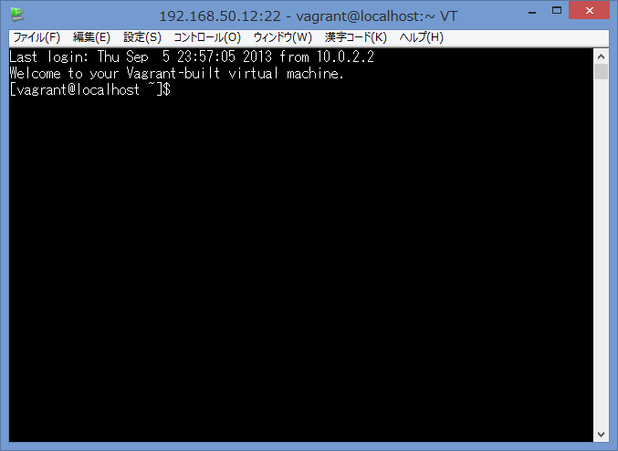

# chef-solo + Vagrant on Windows

WindowsをホストOSとしてchef-solo。

## Vagrant

http://www.vagrantbox.es/

```
# CentOS 6.3
vagrant box add base http://developer.nrel.gov/downloads/vagrant-boxes/CentOS-6.3-x86_64-v20130101.box
（...とても時間がかかる）

# CentOS 6.4
vagrant box add base http://developer.nrel.gov/downloads/vagrant-boxes/CentOS-6.4-x86_64-v20130731.box

mkdir example
cd example
vagrant init
A `Vagrantfile` has been placed in this directory. You are now
ready to `vagrant up` your first virtual environment! Please read
the comments in the Vagrantfile as well as documentation on
`vagrantup.com` for more information on using Vagrant.
```

```ruby
# Vagrantfile
Vagrant::Config.run do |config|
  config.vm.box = "base"
#(snip)
  config.vm.network :private_network, ip: "192.168.50.12"
#(snip)
```

```
vagrant up

Bringing machine 'default' up with 'virtualbox' provider...
[default] Importing base box 'base'...
[default] Matching MAC address for NAT networking...
[default] Setting the name of the VM...
[default] Clearing any previously set forwarded ports...
[default] Creating shared folders metadata...
[default] Clearing any previously set network interfaces...
[default] Preparing network interfaces based on configuration...
[default] Forwarding ports...
[default] -- 22 => 2222 (adapter 1)
[default] Booting VM...
[default] Waiting for VM to boot. This can take a few minutes.
[default] VM booted and ready for use!
[default] Configuring and enabling network interfaces...
[default] Mounting shared folders...
[default] -- /vagrant
```

```
C:\Users\noguchi>ping 192.168.50.12

192.168.50.12 に ping を送信しています 32 バイトのデータ:
192.168.50.12 からの応答: バイト数 =32 時間 <1ms TTL=64
192.168.50.12 からの応答: バイト数 =32 時間 <1ms TTL=64
192.168.50.12 からの応答: バイト数 =32 時間 <1ms TTL=64
192.168.50.12 からの応答: バイト数 =32 時間 <1ms TTL=64

192.168.50.12 の ping 統計:
    パケット数: 送信 = 4、受信 = 4、損失 = 0 (0% の損失)、
ラウンド トリップの概算時間 (ミリ秒):
    最小 = 0ms、最大 = 0ms、平均 = 0ms
```

```
D:\Users\noguchi\Documents\tmp\example_box>vagrant ssh
Welcome to your Vagrant-built virtual machine.
[vagrant@localhost ~]$ ls
[vagrant@localhost ~]$ ls /
bin   cgroup  etc   lib    lost+found  mnt  proc  sbin     srv  tmp  vagrant
boot  dev     home  lib64  media       opt  root  selinux  sys  usr  var
```



```
D:\Users\noguchi\Documents\tmp\example_box>vagrant halt
[default] Attempting graceful shutdown of VM...

D:\Users\noguchi\Documents\tmp\example_box>vagrant destroy
Are you sure you want to destroy the 'default' VM? [y/N] y
[default] Destroying VM and associated drives...
```

コマンドラインからサスペンドもできるらしい。  
ライフチェンジング。

```
vagrant suspend

[default] Saving VM state and suspending execution...
```

Macでsshキー生成してみた。  
configに流し込む。

```
vagrant ssh-config --host melody >>~/.ssh/config
```

そして

```
ssh melody
```

### sahara

```
>vagrant plugin install sahara
Installing the 'sahara' plugin. This can take a few minutes...
Installed the plugin 'sahara (0.0.15)'!

>vagrant up

>vagrant sandbox on
0%...10%...20%...30%...40%...50%...60%...70%...80%...90%...100%

>vagrant sandbox rollback
0%...10%...20%...30%...40%...50%...60%...70%...80%...90%...100%
0%...10%...20%...30%...40%...50%...60%...70%...80%...90%...100%

>vagrant sandbox commit

>vagrant sandbox off


```
